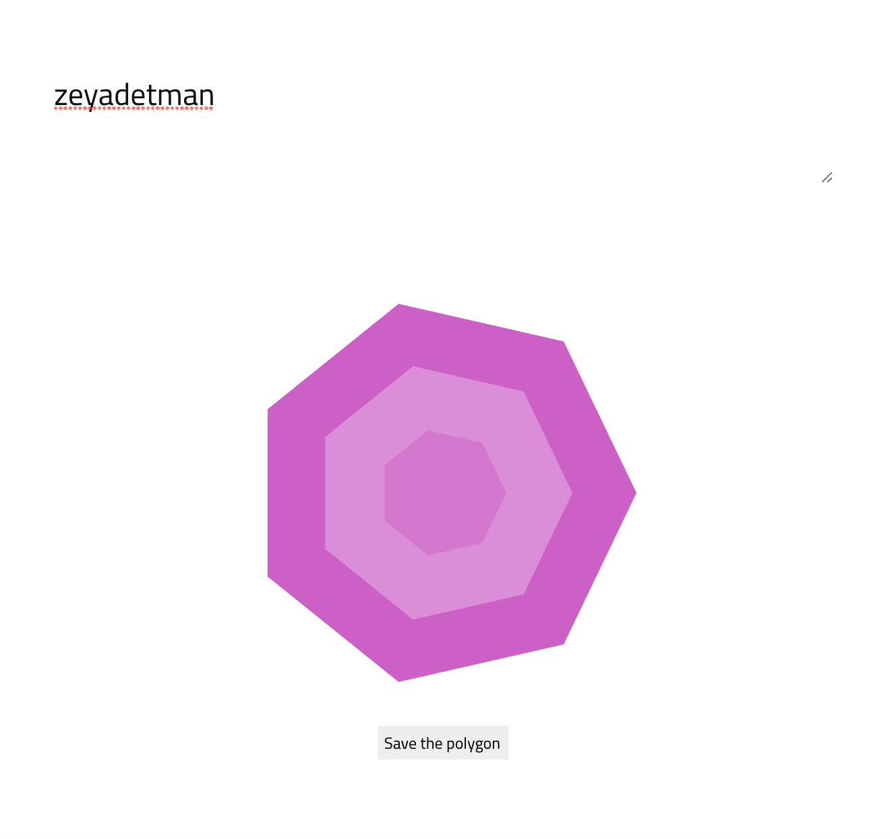

# Polygon Generator



This is a simple polygon generator based on a text.

__Please Note__ Don't use it to build unique avatars for your users as I've built it for fun, and the results may not be unique for all strings.


## Usage

```
npm i
npm run start
```

## Contributing

This is a simple project, you can build up to generate avatar generators for your users.